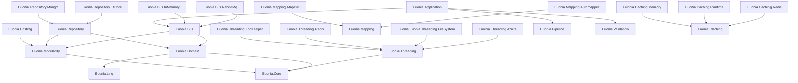

# Euonia
Euonia is a development framework and toolkit library for developers to build .NET application/service. It aims to provide a comprehensive and user-friendly solution to empowers developers to build efficient, scalable and robust systems that can handle complex distributed workflows. Whether you are working on microservices, cloud-native applications, or any other distributed system, it offers a range of features, necessary tools and infrastructure to streamline your development process and enhance the overall performance of your project.

The word "eunoia" refers to a concept derived from the ancient Greek language. It is a term that signifies a state of goodwill, beautiful thinking, and a well-disposed mind. The word "eunoia" combines the prefix "eu," meaning "good" or "well," and "noos," meaning "mind" or "thinking." It encompasses the idea of having a positive mindset, open-heartedness, and a sincere attitude towards others. Eunoia can be seen as a virtue that promotes harmony, empathy, and generosity in interpersonal relationships. It is often associated with the ideal of achieving inner peace and fostering harmonious connections with others.

# Projects

## Diagram

## Core module
- [Euonia.Core](/Source/Euonia.Core)
  > Core library that providers base class, helpers and extension methods.
- [Euonia.Business](/Source/Euonia.Business)
  > Object oriented & scalable business architecture library.
- [Euonia.Grpc](/Source/Euonia.Grpc)
  
  > Providers tools and features to seamlessly integrate gRPC capabilities into projects.
- [Euonia.Hosting](/Source/Euonia.Hosting)
  > A library that helps developer to build a host for .NET application/service quickly.
- [Euonia.Linq](/Source/Euonia.Linq)
  > Toolkit library for LINQ.
- [Euonia.Modularity](/Source/Euonia.Modularity)
  > To be added.
- [Euonia.Pipeline](/Source/Euonia.Pipeline)
  > To be added.
- [Euonia.Validation](/Source/Euonia.Validation)
  > Provides customizable validation capabilities for various data inputs.
- [Euonia.Quartz](/Source/Euonia.Quartz)
  > Provides a simple and easy to use .NET library for scheduling jobs using Quartz.

## Caching module
- [Euonia.Caching](/Source/Euonia.Caching)
  > Defines abstract classes & interfaces for caching service.
- [Euonia.Caching.Redis](/Source/Euonia.Caching.Redis)
  > Implements ICachingService with Redis.
- [Euonia.Caching.Memory](/Source/Euonia.Caching.Memory)
  > Implements ICachingService with *Microsoft.Extensions.Caching.Memory*.
- [Euonia.Caching.Runtime](/Source/Euonia.Caching.Runtime)
  > Implements ICachingService with build-in *System.Runtime.Caching*.

## Domain Driven Design module
- [Euonia.Application](/Source/Euonia.Application)
  > Defines abstract application service classes & interfaces.
- [Euonia.Domain](/Source/Euonia.Domain)
  > Defines abstract domain service classes & interfaces.
- [Euonia.Repository](/Source/Euonia.Repository)
  > Defines abstract repository classes & interfaces.
- [Euonia.Repository.EfCore](/Source/Euonia.Repository.EfCore)
  > Implements IRepository with Entity Framework Core.
- [Euonia.Repository.Mongo](/Source/Euonia.Repository.Mongo)
  > Implements IRepository with MongoDB.

# Donate
 

---

Thanks to [JetBrains](https://www.jetbrains.com/) for supporting the project through [All Products Packs](https://www.jetbrains.com/products.html) within their [Free Open Source License](https://www.jetbrains.com/community/opensource) program.

---

